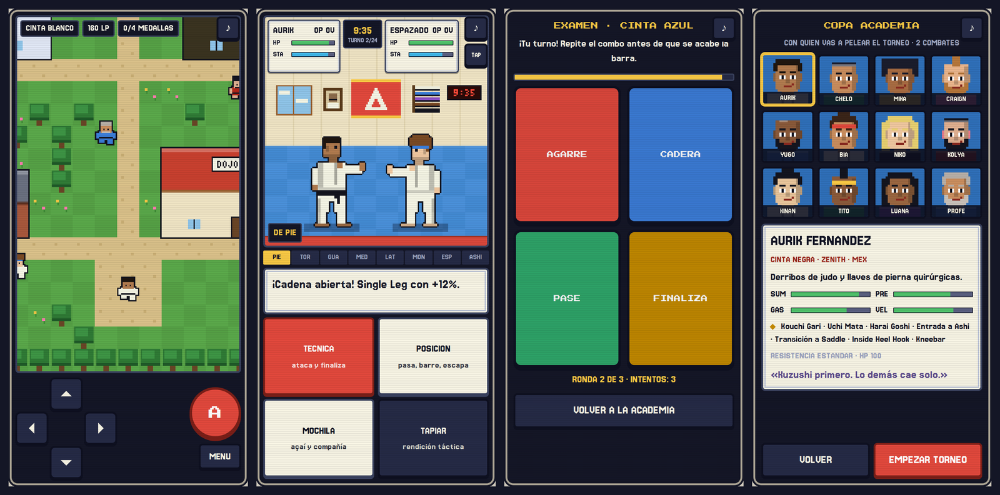
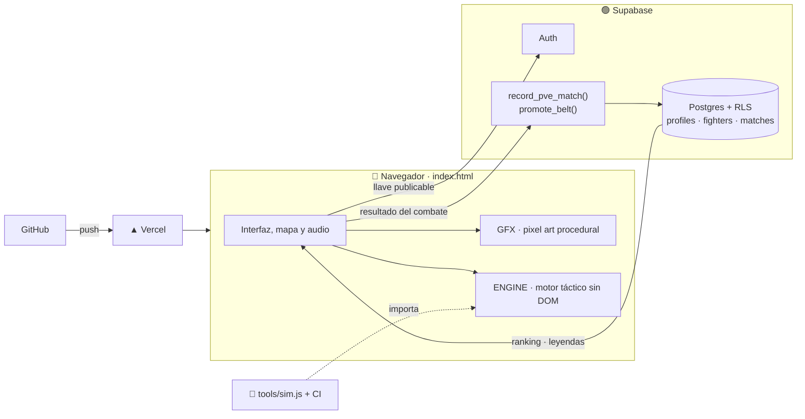

<div align="center">

# 🥋 BJJ Monsters

**Un RPG táctico de Brazilian Jiu-Jitsu en pixel art, hecho para jugarse en el teléfono.**

[](https://bjj-monsters.vercel.app)




</div>

---

## De qué va

Recorres un pueblo, entras a academias y torneos, y peleas por turnos. La diferencia con
cualquier RPG es que aquí **no gana quien pega más, gana quien domina la posición**, igual que
en el tatami: una sumisión desde la montada o la espalda vale 40 % más que desde la guardia, y
encadenar técnicas reales (armbar → triángulo → omoplata) abre huecos que un ataque suelto no.

Subes de cinta presentando un examen de coordinación frente al profe. Si lo repruebas tres
veces, te manda a acumular tatami antes de volver.

## Lo que tiene

| | |
|---|---|
| 🗺️ **Mundo caminable** | Un pueblo con academia, garaje de open mat y tres sedes de torneo. Cruceta táctil, vecinos con los que hablar y puertas que se abren conforme ganas medallas. |
| ⚔️ **Combate posicional** | 8 posiciones, 115 técnicas reales, puntos y ventajas como en un torneo, estamina, y cadenas que premian pensar dos turnos adelante. |
| 🥋 **Progreso de verdad** | Experiencia por combate, niveles que dan vida, y cintas que se ganan con examen y desbloquean objetos y mejores cadenas. |
| 👥 **12 luchadores + tu personaje** | Cada uno con su juego: mariposa, berimbolo, solapas, rubber guard, presión, llaves de pierna. El tuyo es único en todo el juego. |
| 🏆 **Salón de la fama** | Quien termina el circuito convierte a su personaje en rival para todos los demás. |
| 🎵 **Música que reacciona** | Cuatro temas chiptune; el combate cambia a un tema tenso cuando alguien está contra las cuerdas. |

## Decisiones de ingeniería

Este proyecto es también un ejercicio deliberado de restricciones. Las que más definieron el resultado:

**Cero dependencias, cero build, cero assets.** Todo el juego es un `index.html` de ~130 KB.
Los sprites, los retratos, los cinco escenarios y el mapa se dibujan con rectángulos sobre
`<canvas>`; la música y los efectos se sintetizan en Web Audio. No hay una sola imagen ni un
archivo de audio. Carga instantánea en una red móvil mala, y nada que se rompa con una
actualización de npm.

**El motor de combate no conoce el navegador.** El bloque `ENGINE` es JavaScript puro: recibe
un estado, devuelve eventos. Eso permite tres cosas: simular miles de combates en Node para
balancear, probarlo sin DOM, y moverlo tal cual a una Edge Function cuando llegue el PvP con
resolución en el servidor.

**El balance se mide, no se intuye.** `tools/sim.js` juega miles de combates por cruce y la CI
lo corre en cada push. Hoy, contra el jefe final, un jugador óptimo gana entre 32 % y 60 %
según el personaje; uno que aprieta botones al azar, entre 11 % y 21 %.

**El jugador es el atacante.** En un juego con ranking, quien hace trampa es el propio usuario
desde su consola. Por eso el navegador no puede escribir sus puntos, su nivel ni su cinta: los
combates pasan por una función de Postgres con rate-limit, y el examen de cinta se valida en el
servidor contra los puntos reales. Todo está probado contra la base de producción, con
intentos de trampa incluidos. Detalle en [`docs/SECURITY.md`](docs/SECURITY.md).

**Falla con gracia.** Si Supabase o la CDN no responden, el juego sigue completo en modo local
en vez de colgarse en el registro.

## Arquitectura



## Stack

`JavaScript` sin frameworks · `Canvas 2D` · `Web Audio API` · `PWA` (service worker + manifest) ·
`Supabase` (Postgres, Auth, Row Level Security, funciones `security definer`) · `Vercel` con
cabeceras CSP y HSTS · `GitHub Actions`.

## Correrlo

```bash
git clone https://github.com/antuansabe/bjj-monsters-.git
cd bjj-monsters-
python3 -m http.server 8000     # http://localhost:8000
```

No hay `npm install`. Para revisar el balance: `node tools/sim.js 1000`.

## Mapa del repo

```
index.html              El juego. Bloques: CONFIG · ENGINE · GFX · interfaz, mapa y examen
supabase/schema.sql     Instantánea del esquema: tablas, RLS, triggers y funciones
supabase/migrations/    Cambios en orden, listos para `supabase db push`
tools/sim.js            Simulador de balance
docs/                   ROSTER · DEPLOY · SECURITY
.github/workflows/      CI: sintaxis, balance y SQL
```

## Lo que sigue

- [ ] Arena PvP en tiempo real, con el motor corriendo en una Edge Function
- [ ] Más pueblos en el mapa y rivales que te retan al caminar
- [ ] Técnicas que se desbloquean por cinta

## Notas

Los personajes son ficticios y sus nombres son guiños cariñosos a la cultura del jiu-jitsu.
Las técnicas, las posiciones y las secuencias sí son reales.
En iOS no hay vibración: Safari no soporta `navigator.vibrate`.

---

<div align="center">

Hecho con ♥ en Ciudad de México por **[Antonio Fernández Dromundo](https://github.com/antuansabe)**
<br/>Senior AI Engineer · cinta que sigue presentando exámenes

</div>
